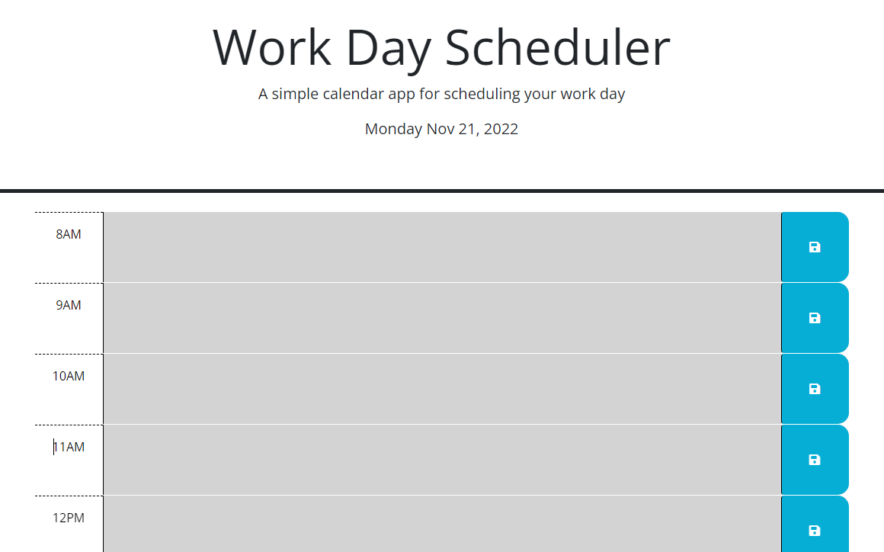

# Work day scheduler

## Name
Work day scheduler

## Description
This program helps you organize your work day. You can add, hour by hour, what you need to work on for the day, and save it so the content will remain even when you refresh the page. The site will automatically color-code which hour you're presently in, has already passed, and is in the future. To view in pages, click [here](https://sifrult.github.io/work-day-scheduler/)

## Visuals

